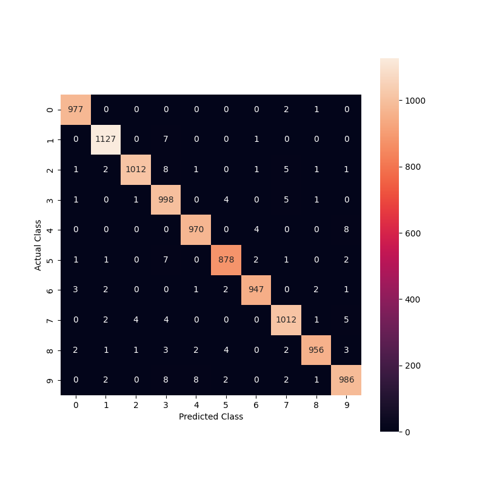
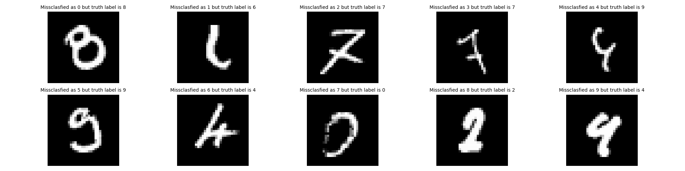
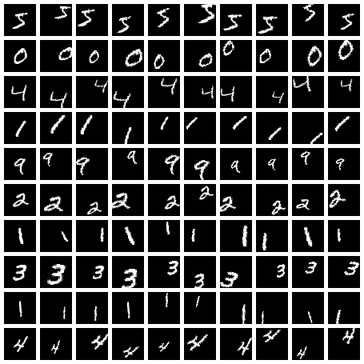
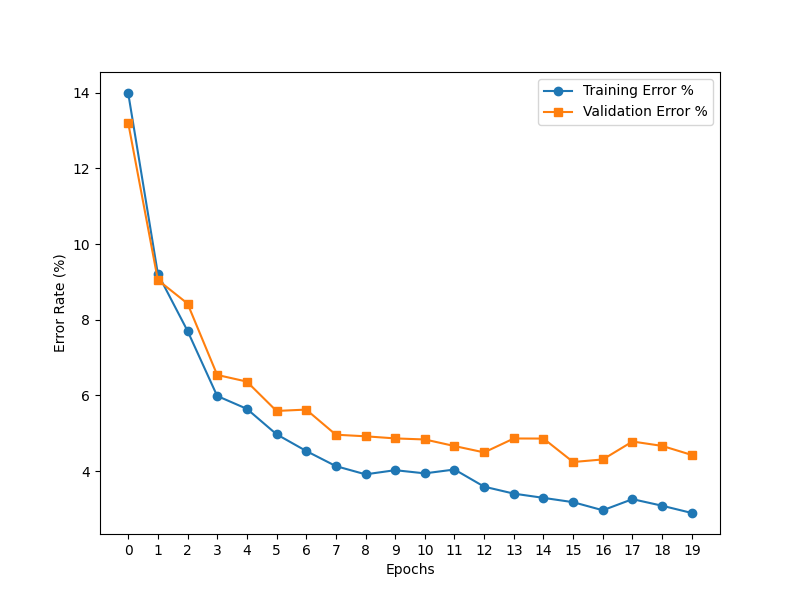

# Remaking Original LeNet5

**Files**

- LeNet5_1.pth - The model

  - BOX LINK:
    <https://rutgers.box.com/s/j8ptygcabbqvy9xoba3ck1ea4exlkx8h>

- test1.py

  - **used for grading**

  - has the proper **prepossessing** **transforms**

  - has the proper **test code**

- LeNet5_data.py

- LeNet5_train.py

- LeNet5_test.py

- MNIST Data Problem 1 Folder

  - outputed data from LeNet5_data.py

  - used in training and testing

- RBF Kernel Folder

  - rbf_kernel.py

  - Data Folder

    - data used to make the kernels

  - FinalKernels Folder

    - 1 image per kernel (for visualization)

    - rbf_weights (used in training)

**Graphics**

- most_confusing_test_samples.png

- test_train_error_perc.png

- confusion_matrix.png

**Libraries**

- pandas

- torch

- torchvision

- PIL

- torchsummary

- numpy

- matplotlib

- torcheval

- seaborn

**How to Run** First, *LeNet5_data.py* was used to normalize the data
from online and store the data in *MNIST Data Problem 1* Folder. Then we
used LeNet5_train.py to train and save the model to *LeNet5_Final.pth*.
Then we used *LeNet5_test.py* to do the **Performance Evaluation**
section bellow.

The input to the model must be **32x32 images** each pixel value being
from $`[-.1, 1.175]`$. **X tensors must be shape float32 (samples, 1,
32, 32) and y tensors must be of shape int64 (samples). (NOT
one-hot-encoded for training.)**

## Architecture

The goal of Problem 1 was to implement LeNet5 as described in the
original research paper. Keeping that in mind, here is the architecture:

**C1 Layer:** 1 in channel, 6 out channels, 5x5 kernel, stride = 1,
padding = 0. TanH as an activation function.

**S2 Layer**: in channels=6, 2x2 kernel, stride=2. TanH as an activation
function. This was a custom pytorch layer. It summed all the values in
the 2x2 frame, multiplied by a weight, and then added a bias.

**C3 Layer**: in channels = 6, out channels = 16, 5x5 kernel, stride =
1, padding = 0. TanH as an activation function. This was a selective
convolution layer. It was implemented as a custom pytorch layer.
Basically, each of the six input layers was mapped to 10 of the 16
output layers. The mapping were specficed from the research paper.

**S4 Layer:** in channel = 16, 2x2 kernel, stride=2. TanH as an
activation function. Similar to the S2 Layer.

**C5 Layer:** in channels = 16, out channels = 120, 5x5 kernel, stride =
1, padding = 0. TanH as an activation function. After, this channel is
flattened into an tensor of size Batch x 120

**F6 Layer:** in features = 120, out features = 84. Just a normal Fully
connected layer.

**Output Layer**: To get to the output layer, which is of size Batch x
10, we used RBF Kernels. Their weights are frozen. We have 10 RBF
kernels, one for each digit. We used the DIGIT dataset linked in the
instructions pdf. For each digit, we made a mean image of size. Then we
performed a center crop of 100 x 80 to get to closer to the final aspect
ratio and also we noticed there were empty space in the edges so we were
able to crop without getting rid of information. Then we resized it to a
7x12 image, and then clamped the values. So values less than .5 would be
0 and values greater than .5 would be 1. Then we flattened each digit to
a 84 value 1D tensor and saved it in *./FinalKernels/rbf_weights.* We
did 84 beceause the F6 layer had 84 out features.

<figure id="fig:grid" data-latex-placement="H">
<table>
<tbody>
<tr>
<td style="text-align: center;"></td>
<td style="text-align: center;"></td>
<td style="text-align: center;"></td>
<td style="text-align: center;"></td>
<td style="text-align: center;"></td>
</tr>
<tr>
<td style="text-align: center;"></td>
<td style="text-align: center;"></td>
<td style="text-align: center;"></td>
<td style="text-align: center;"></td>
<td style="text-align: center;"></td>
</tr>
</tbody>
</table>
<figcaption>7x12 RBF Kernels per digit</figcaption>
</figure>

**Other notes:** The parameters for each layer are initialized between
$`[-2.4/Fi, 2.4/Fi]`$. $`Fi`$ is the number of inputs in the layer. Each
layer up to F6 has a tanh activation function $`f(a) = Atanh(Sa)`$.
$`A = 1.7159`$. $`S = 2/3`$. Num of epochs = $`20`$ and batch size =
$`1`$.

## Training

### Data

The LeNet5_data.py file handles are input data for us. First we convert
each 28x28 image to a 32x32 image by adding 2 pixel padding on each
side. Then we normalize them each pixel value to between
$`[-.1, 1.175]`$. Then we export the digits into 4 files: XTrain,
yTrain, XTest, yTest.

### Optimizer

We used the built in pytorch SGD optimized with a learning rate of
.0001.

### Criterion (Loss Function)

``` math
E(W) = \frac{1}{P} \sum_{p=1}^{P} \left( y_{Dp}(Z^p, W) + \log \left( e^{-j} + \sum_i e^{-y_i(Z^p, W)} \right) \right)
```

This is the loss function that is used. $`j = .1`$. $`P`$ are the number
of samples in the batch. $`y_{Dp}(Z^p, W)`$ is the output value of the
$`Dpth`$ RBF kernel, where $`Dp`$ is the correct classification for
sample $`p`$. In the second summation, we exponentiate the negative
output value of all the other incorrect digit RBF kernels. So when using
this log function, the **argmin** of the logits refers to the predicted
class. To use the loss function in python, the Y tensor must be
converted to a one-hot-encoded tensor.

## Performance Evaluation

### Error Rates

On epoch 20, the Train Error was $`0.82\%`$, and the Test Error was
$`1.37\%`$.

<figure id="fig:enter-label" data-latex-placement="H">

<figcaption>Error Rates. Shows that around epoch 10-11, the test error
stabilized, but the train error continued decrease which indicated
slight over fitting. It is not major over fitting because the test error
is not getting worse.</figcaption>
</figure>

### Confusion Matrix

<figure id="fig:enconsfuter-label" data-latex-placement="H">

<figcaption>Confusion Matrix on test data of <span
class="math inline">\(10000\)</span> samples. The rows represent the
actual digit labels, while the columns represent the predicted digit
labels. Each cell indicates the number of instances for the
corresponding actual and predicted digit combination.</figcaption>
</figure>

### Most Confusing

<figure id="fig:ente3r-label" data-latex-placement="H">

<figcaption>Most Confusing Sample. This figure answers the question:
"What image was misclassified with the highest confidence as the digit
"x." So just to explain further, the last image in the figure above was
misclassified with the highest confidence as "9" but was in reality a 4.
</figcaption>
</figure>

# Modified LeNet5 - The FUN PART

**Files**

- LeNet5_2.pth - The Model

  - BOX LINK:
    <https://rutgers.box.com/s/2emopqzvsnwi58yr5didjfe1ageblu1x>

- test2.py

  - **used for grading**

  - has the proper **pre-processing transforms**

  - has the proper **test code**

- ModifiedLeNet5_data.py

- ModifiedLeNet5_train.py

- ModifiedLeNet5_test.py

- affNIST Data Problem 2 Folder

  - outputed data from ModifiedLeNet5_data.py

  <!-- -->

  - used in training and validation

- Problem 2 Models Folder

  - used to store the models after each epoch

**Graphics**

- P2_test_validation_error_perc.png

- P2_transformed_data_sample.png

**How to Run** First, ModifiedLeNet5_data.py is used to collect and
prepare the data and then is stored in *affNIST Data Problem 2 Folder*.
Then we use *ModifiedLeNet5_train.py* to train the model and store each
model after each epoch in the *Problem 2 Models Folder*. Then I examine
the *P2_test_validation_error_perc.png* graph to see if there is any
over fitting and the copy and move over the ’best’ model from the
*Problem 2 Models Folder* to *ModifiedLeNet5_Final.pth*.

The input to the model must be **40x40 images** with each pixel value
being from $`[0, 1]`$. **X tensors must be shape float32 (samples, 1,
40, 40) and y tensors must be of shape int64 (samples). (NOT
one-hot-encoded for training.)**

## Overview

So the goal of Question 2 is to make your own model that handles
transformed MNIST data. To tackle that, we have taking a 3-prong
approach: **Data Augmentation**, **Modern Blocks**, and **Early
Stopping**.

## Data Augmentation

So for **training** we made our own augmented data from the original
MNSIT data set. For each of 60,000 original training samples, we applied
10 transformations to reach a total of **600,000 training samples**. The
code can be scene in ModifiedLeNet5_data.py. First we converted each
MNIST image from a 28x28 image to a 40x40 image. This expansion gave us
room to play around with our transformations without digits being cut of
at the edges. Then we applied random affine transformations with the
following values: degrees=\[-20, 20\], shear=\[-.2, .2\],
translate=(0.3, 0.3), scale=(0.7, 1.3). The reasoning for doing this
data augmentation was because we knew that we would be tested on unseen
MNSIT data in a random style. So the easiest way to come up with new
data was to apply random transformation to the original data and train
on it. We could have used the provided the training data from the
affNIST data set online, but we decided not to, so we can practice Data
Augmentation.

Then for **validation**, we ended up using the affNIST data set from
online, because we wanted a different source of unseen data that would
have different transformation so we can thoroughly pick the best model.

All data for problem 2 is stored in the *affNIST Data Problem 2* Folder.

<figure id="fig:enter-label" data-latex-placement="H">

<figcaption>Sample Data from X_train</figcaption>
</figure>

## Modern Blocks

So the original LeNet5, as implemented in Problem 1, was made in 1998.
During that time, modern blocks were not thought off. So we decided to
make 4 changes to the architecture.

**First** we replaced the sub sampling layers with Max Pool. The
original LeNet-5 employed subsampling, which averages the 2x2 pixels
within a region to reduce dimensionality. This approach smooths the
feature maps and provides some robustness to small variations, but it
often loses critical high-frequency details like edges or corners, which
are essential for distinguishing digits, especially under
transformations like rotation or scaling. Max pooling, on the other
hand, preserves these distinctive features by selecting the maximum
activation in a given 2x2 reigon. This not only helps in retaining the
most prominent patterns but also makes the network more invariant to
slight positional shifts in the input data. As a result, max pooling
enhances the model’s ability to generalize to unseen transformed MNIST
data by ensuring that vital features remain intact throughout the
forward propagation.

**Second** we replace the selective C3 layer with a normal fully
connected C3 Conv2d layer. In the original LeNet-5, the selective C3
layer used a predefined connectivity pattern, where only specific
subsets of input feature maps contributed to certain output feature
maps. This design reduced the computational complexity for 1998 but
limited the network’s capacity to learn diverse and complex feature
interactions. By replacing the selective C3 layer with a fully connected
Conv2D layer, the new architecture allows all feature maps from the
previous layer to contribute to every output feature map. This increased
flexibility enables the model to capture a more transformations like
rotations, distortions, or noise in modified data.

**Third** we replace the tanh activation functions with LeakyReLU. The
tanh activation function, used in the original LeNet-5, squashes values
into a narrow range, which can result in vanishing gradients for extreme
input values. This significantly slows down learning, especially in
deeper networks, and makes it harder to adapt to variations in input
data. In contrast, LeakyReLU introduces a small slope for negative input
values, allowing gradients to flow even when inputs are negative. This
eliminates the dead neuron problem faced by normal RELU and ensures that
learning remains efficient throughout the network.

**Forth** we replace the last RBF Layer with a simple Fully Connected
Linear Layer. The RBF kernel layer in the original LeNet-5 acted as a
distance-based classifier, where outputs were determined by the radial
distance from fixed weights, ie the average shape of each digit. While
this approach works well for datasets with limited variability, it
struggles with unseen transformations, as the weights may not adequately
represent the transformed data. Replacing the RBF kernel with a linear
fully connected layer introduces greater flexibility by enabling the
model to learn a set of adaptable weights for classification. For unseen
transformed MNIST data, a fully connected layer provides the
adaptability to new patterns and variations, significantly improving the
model’s robustness and accuracy.

## Early Stopping

The last major change we did was to combat over fitting. Since we have
so much training data, we were afraid that the model might over fit. So
what implemented our own version of "early stopping." We saved the model
after each epoch and kept track of the model’s training and validation
errors. Then after 20 epochs, we looked at the error graph bellow, and
picked the best model. We decided to pick the model after epoch 16
because right before we saw the validation error jump. We think that at
this epoch the model could generalize well to unseen data. One thing to
note is that after each epoch, we did not calculate the error rates on
the FULL train and validation sets, instead we used a random subset of
the training and validation sets to plot the error rates, because if we
used the FULL sets, it would take too long.

## Results

Final Validation Error on the full validation set is $`4.185\%`$ .

<figure id="fig:edddnter-label" data-latex-placement="H">

<figcaption>This is the error rates graph for Problem 2. Read the Early
Stopping Section to see what model we picked.</figcaption>
</figure>
